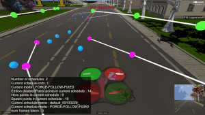

# Extra tools for data collection

While working on the follow me project, I found a bit troublesome to record the data one path at a time. Essentially, the approach was the following :

*   Make paths for quad and hero, and make spawn points.
*   Make a recording.
*   Clear everything and repeat for another section of the environment.

This works, but I found it difficult when trying to get large amounts of data, as I had to repeat the process again and again for each recording. If I made a mistake, then I should clear the path and start over, and if I had a working configuration, I could not save it for later editing or re-usage.

To solve these issues I made some changes to the codebase of the simulator, adding some tools to solve these issues.

## **Modified approach**

The approach I took was to allow user edition and saving/loading of the paths and spawn points he's currently editing. Now, the steps would look like this (modified state machine) :


The functionality from the previous version is kept as usual, and we just added some extra functionality on top of the current codebase to avoid conflicts.

### _**Schedules**_

The paths for the hero and quad, as well as the spawn points for the crowd are abstracted into a single object called [**PathSampleCompound**](https://github.com/wpumacay/RoboND-QuadRotor-Unity-Simulator/blob/master/Assets/Scripts/PathPlanner.cs) (in order to make it serializable and allow saving to a json easily).

Then, this is further abstracted into an object called [**DataExtractionSchedule**](https://github.com/wpumacay/RoboND-QuadRotor-Unity-Simulator/blob/master/Assets/Scripts/DataExtraction/DataExtractionSchedule.cs), which holds a compound, as well as some more functionality for batch recording, visualization, etc.

### _**DataExtractionManager**_

This is the class that holds almost all of the functionality that I added. It holds a list of the current schedules, it has the link to the key presses to allow the user to use this functionality, and more. This is a singleton, and some code integration was needed in a few places, and I checked this integrations does not break the normal default operation (if something breaks, just let me know at wilsanph@gmail.com).

These are the features exposed to the user using the appropiate keys :

*   **Home** and **End** keys : allow the user to go to the next or previous schedule.
*   **Z** : loads the schedules (request for a folder and loads all .json files in that folder).
*   **X** : saves the current schedules as .json files into disk (request the user for a location and save each schedule as a separate .json file in that folder).
*   **U** : begins batch recording.
*   **V** : begins batch recording for only the current schedule.
*   **PageDown** : toggles the current edition mode for the schedules (in edition mode the user can change the name and mode of recording of the current schedule).
*   **Delete** : removes current schedule.
*   **Insert** : creates a schedule from the working managers (hero, path and spawn) and adds it to the schedules list.
*   **Return** : Changes the follow mode of the schedule to either **free** (patrols the path in the schedule), **follow** (follows the target in the schedule) and **follow-far** (same as previous, but at a bigger distance of the target).

### _**Batch recording**_

This is the main feature I made these changes for. This allows the user to send a single request to record data from all schedules so far. It does so one by one until all have finished recording the data (each one is hard-coded to take a batch of 1000 images, for now, but can be extracted to another option). The data is saved in one folder per schedule, with each folder containing the input data to the preprocess step.

## New features in action

*   _**Creating and navigating schedules**_


*   _**Deleting schedules**_



*   _**Loading previously saved schedules**_


*   _**Batch Recording**_


## Modified preprocessing script

In order to transform the whole batch recorded, we modified the preprocessing script to account for these changes. Basically, you can still run the original preprocessing script, but it would have to be done for each folder. Instead, using [**this**] version of the preprocessing script you can you can generate your dataset from all the folders created for each recording. The usage is the following :

```
python preprocess_ims.py "ROOT_FOLDER" "MODE" --joinFolder "JOIN_FOLDER" --singleFolder "SINGLE_FOLDER"
```

There are two mandatory arguments :

*   ROOT_FOLDER : The base folder where all the recording folders were saved.
*   MODE : Mode of operation, which could be SINGLE (generate for just a single folder), GROUP (generate for all subfolders in the base root folder), or JOIN (to join each generated folder into an output folder, as preprocessing in group mode is done per-folder).

The other are optional parameters, used depending on the mode :

*   JOIN_FOLDER : A base folder where all results are located. This folder is used to search for all images and generate an unique dataset.
*   SINGLE_FOLDER : A folder path to use if in single mode.